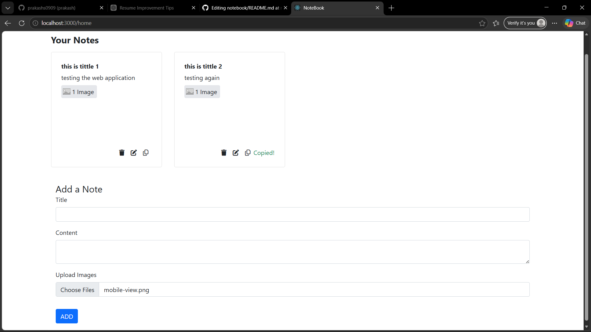
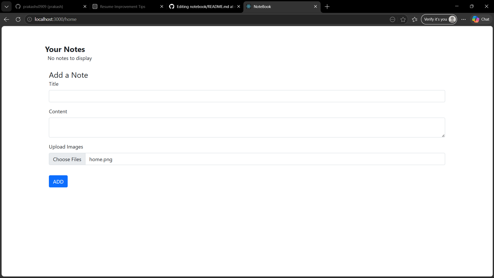
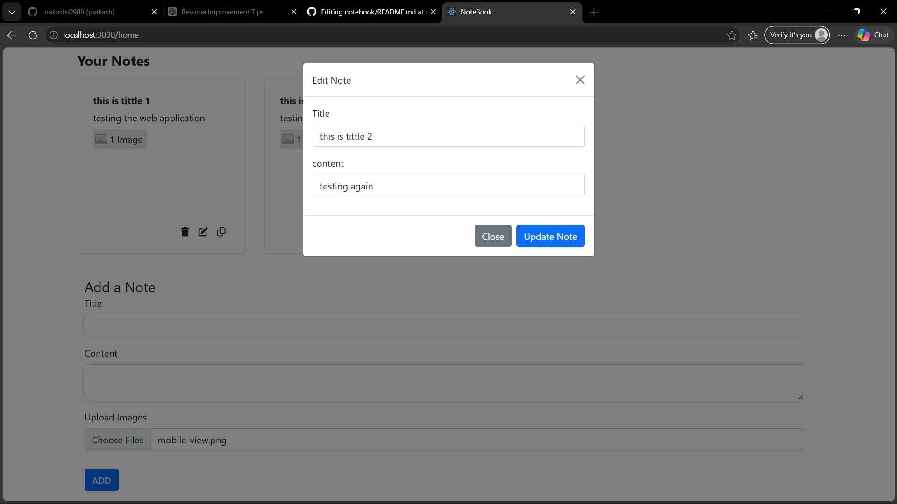

# 📝 Notebook App (MERN Stack)

A full-stack web application that allows users to securely create, manage, and organize personal notes online.

---

## 🚀 Features

* 🔐 User Authentication using JWT
* 📝 Create, Read, Update, Delete (CRUD) Notes
* ☁️ Persistent storage with MongoDB
* ⚡ Fast and responsive UI using React
* 🔄 Real-time updates with Context API
* 🔒 Protected routes for secure access

---

## 🛠 Tech Stack

**Frontend:** React.js, Context API, Bootstrap
**Backend:** Node.js, Express.js
**Database:** MongoDB 
**Authentication:** JWT (JSON Web Tokens)

---

## 📸 Screenshots

### 📝 Notes Dashboard



### ➕ Add Note



### 🏠 Edit Note Page



---


## ⚙️ Installation & Setup

### 1. Clone the repository

```bash
git clone https://github.com/prakashs0909/notebook.git
cd notebook
```

### 2. Install dependencies

#### Backend

```bash
cd backend
npm install
```

#### Frontend

```bash
cd frontend
npm install
```

---

### 3. Setup Environment Variables

Create a `.env` file in backend folder:

```env
MONGO_URI=your_mongodb_connection_string
PORT=5001
SECRET_KEY=your_secret_key
```

---

### 4. Run the app

#### Start backend

```bash
npm start
```

#### Start frontend

```bash
npm start
```

---

## 📂 Folder Structure

```
notebook/
├── backend/
│   ├── routes/
│   ├── models/
│   ├── middleware/
│   └── server.js
├── frontend/
│   ├── components/
│   ├── context/
│   └── App.js
```

---

## 💡 Future Improvements

* 🌙 Dark mode
* 📱 Mobile optimization improvements
* 🔍 Search & filter notes
* 📌 Pin important notes

---

## 👨‍💻 Author

**Prakash Saini**
🔗 GitHub: https://github.com/prakashs0909
🔗 LinkedIn: https://www.linkedin.com/in/prakash-saini03/

---

## ⭐ Show your support

If you like this project, please ⭐ the repo!
